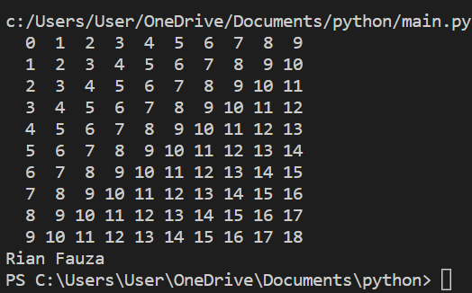

## latihan 1

pertama-tama kita buat input terlebih dahulu contohnya seperti dibawah ini:
```
x = int(input('Masukan bilangan pertama : '))

y = int(input('Masukan bilangan kedua : '))
```
lalu kita enter, masukan if untuk menjalani program yang sebelumnya dan tambahkan x > y : lalu print('Bilangan terbesar = ', x)

lalu tambahkan else untuk menambah aksi untuk menentukan bahwa x lebih besar dari y 

 else :
 
      print('Bilangan terbesar = ', y)
      
dan saat running kita diminta untuk memasukan bilangan pertama lalu bilangan kedua,      
lalu hasil runing nya seperti gambar berikut:


## latihan 2

pertama-tama kita buat input terlebih dahulu contohnya seperti dibawah ini:
```
a = int(input('Bilangan ke-1 = '))

b = int(input('Bilangan ke-2 = '))

c = int(input('Bilangan ke-3 = '))
```
lalu tambahkan 
```
if a < b:

    if b < c:
    
        print('Urutan bilangan : ', a,b,c)
        
    else:
    
        print('Urutan bilangan : ', c,a,b)
        
else:

    if a < c:
    
        print('Urutan bilangan : ',b,a,c)
        
    else:
    
        if b < c:
        
            print('Urutan bilangan : ', b,c,a)
            
         else:
         
            print('Urutan bilangan : ', c)
```            
dan saat running kita sebut bilangan yang ingin kita urutkan 
lalu hasil running nya seperti gambar berikut:


## latihan 3

pertama-tama kita buat codingannya dulu seperti berikut:
```
for i in range(0, 10):

    for j in range(0, 10):
    
        product = i+j
        
        print(f"{product:>3}", end='')
    print()
print("Rian Fauza")

maka runingannya akan seperti gambar berikut:
```




## latihan 4

pertama-tama kita buat codingannya dulu seperti berikut:
```
import random

n = int(input("masukan nilai N : "))

for i in range(n):

    a = random.uniform(0.0, 0.5)
    
    print("data ke :", i+1, "=> ", a)
    
    print("Rian Fauza")
```    
setelah runing akan diminta masukan nilai N, disini saya memasukan nilai n-nya 9
dan hasil runningannya akan seperti gambar berikut:


## latihan 5


jadi masukan r, f, d sebagai inputan untuk memasukan bilangan
lalu tambahkan if menandakan bahwa r lebih besar dari f lalu tambahkan titik dua 
jadi seperti ini
If  r > f:
lakukan juga pada r dan d lalu print dan ketik masukan bilangan terbesar,
lalu selanjutnya tambahkan elif dan else yaitu untuk menambah aksi untuk menentukan bahwa r lebih besar dari d dan f lebih besar dari d,
setelah menjalani codingan sperti penjelasan dan gambar di atas lalu runing


setelah running masukan bilangan dari yang terbesar hingga terkecil, hasil akhirnya menunnjukan bilangan terbesar dari tiga bilangan yang di masukan

## latihan 6


pertama-tama kita print dan masukan nama kita 
lalu masukan n, =, dan 1, lalu enter dan masukan a, =, dan 0. jadi keliahatnnya seprti ini:
```
r=1
f=0
```
fungsi nya adalah untuk menentukan nilai terbesar, lalu enter dan tambahkan while r, !, =, 0, dan :. setelah itu enter, nah pas saat enter pastikan tidak sejajar dengan while, setelah itu tambahkan if r, >, f, dan : enter lalu tambahkan f = r, kemudian enter tambahkan r dan = lalu input ketik masukan bilangan gunakan (, :, dan " sebagai syntax nya, lalu lanjut enter dan tambahkan if, r, ==, 0, dan : enter dan masukan break tidak sejajar dengan if, enter masukan prinan sperti sbmnya bedanya tambahkan f. jadi keliatannya seperti ini:
```
while r !=0:

    if r > f:
        f = r
    r = int(input("masukan Bialangan: "))
    
    if r == 0:
        break
    print("Nilai terbesarnya adalah:", f)
```
fungsinya adalah memasukan nilai terbesar.


setelah running dari hasil codingan di atas lalu masukan bilangan terbesar lalu enter dan masukan nilai yang lebih kecil kemudian enter lagi dan akan menentukan nilai terbesarnya.

## latihan 7


masukkan codingan sperti diatas adalah untuk menghitung laba dari bulan kesatu hingga ke 8


